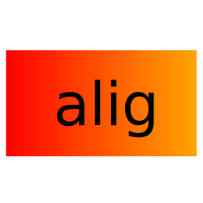

  <a href="https://alig.ondaniel.com.br/">
    

      <h1 style="color: #ff0000">ALIG</h1>
    

    
  </a>
   
   
  

    
    
  

  

## Introduction

[ALIG](https://alig.ondaniel.com.br/) is a app to get aliexpress product info and post it on instagram.

## Features

-

## Endpoints

| METHOD | PATH | SHORT DESCRIPTION                                  |
| ------ | ---- | -------------------------------------------------- |
| POST   | /    | Get an aliexpress product and post it on instagram |

## How to run

1. Install project dependencies:

   `npm install` or `yarn install`

2. Copy `.env.example` located at the root folder to a new `.env` file and fill it with your instagram account credentials.

3. Run project:

   `npm run dev` or `yarn dev`

## How to build

1. Generate `build` folder:

   `npm run build` or `yarn build`

2. Copy `ecosystem.config.example.js` located at the root folder to a new `ecosystem.config.js` file.

3. Run project:

   `npm run start` or `yarn start`

## How to contribute

If you want to contribute with me to improve it and add new features, you can make a PR or contact me by any contact method listed in my [Github Profile](https://github.com/ondanieldev).

## License

MIT © [Daniel Oliveira](https://ondaniel.com.br)
